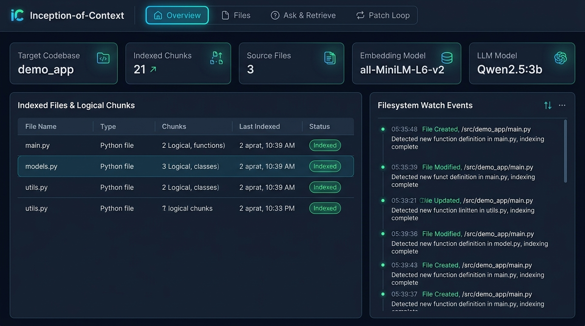
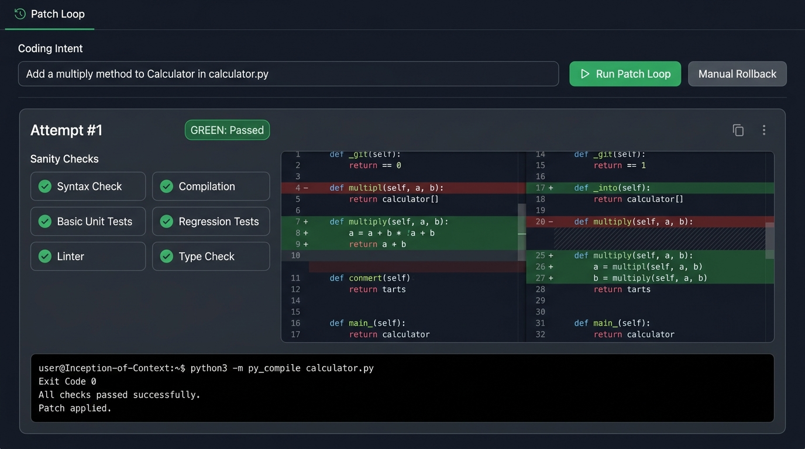
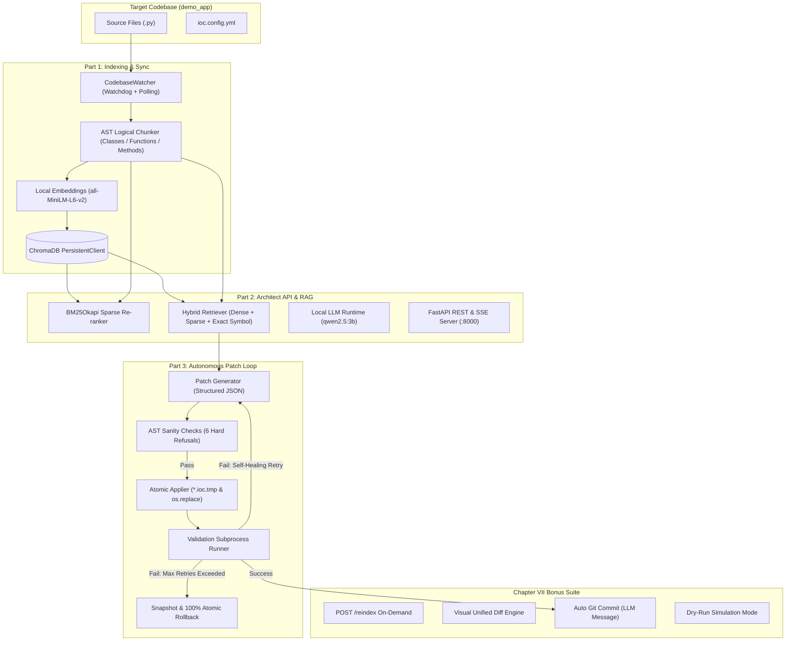

# Inception-of-Context (IoC)

> **AI-Native Autonomous Codebase Engine: Local-First Hybrid RAG, AST-Grounded Context & Self-Healing Patch Loop with 100% Atomic Rollback.**

An offline, zero-external-dependency software engineering agent built for the 42 curriculum. IoC indexes codebases into logical AST chunks, performs deterministic hybrid semantic retrieval, answers architectural queries via local LLMs, and autonomously executes a multi-attempt self-healing patch loop with strict AST sanity refusals, test validation, and guaranteed 100% atomic rollbacks.

---

## Dashboard Preview

### 1. Overview Tab - Live Indexing & Watcher Sync


### 2. Patch Loop Tab - Autonomous Coding & Self-Healing


---

## System Architecture



---

## Core Capabilities

### 1. Part 1 - Logical Indexing & Filesystem Synchronization
- **AST Code Splitting:** Never cuts functions in half. Splits Python source files into logical units (functions, methods, classes) with start/end lines and SHA-256 hashes.
- **Incremental Sync:** Changing one file updates only that file's chunks in ChromaDB. Deleting a file purges its vectors immediately.
- **100% Offline Embeddings:** Embedded locally using `all-MiniLM-L6-v2` with zero external API calls.

### 2. Part 2 - Architect API & Anti-Hallucination RAG
- **Hybrid Retrieval:** Dense vector cosine similarity blended with sparse BM25Okapi scoring.
- **Zero-Hallucination Ground Truth:** AST symbol pre-resolution guarantees truthful responses to queries like *"is there a function called X?"*.
- **Local LLM Orchestration:** Async client interfacing with local `qwen2.5:3b` via Ollama on `127.0.0.1:11435`.
- **Gutter Chunk Viewer:** Interactive code explorer displaying `▶` markers at every AST chunk boundary.

### 3. Part 3 - Autonomous Patch Loop & 100% Rollback
- **Structured JSON Patches:** Sits on a strict schema (`{"explanation": "...", "files": [{"path": "...", "op": "...", "content": "..."}]}`). Free-form diffs are forbidden.
- **6 Hard Refusal Sanity Checks:**
  1. No leaked retrieval markers (`=== RETRIEVED`, `--- Chunk`).
  2. No overwriting existing files via `create`.
  3. No empty/null file replacements (`""`, `"None"`, `"null"`).
  4. No stub functions containing only `pass`, `...`, or `return None`.
  5. No file shrinkage exceeding 60%.
  6. Maximum 3 files touched per patch.
- **Self-Healing Retry Loop:** When validation fails, compiler/test error outputs (`stderr`/`stdout`) are fed back to the LLM for up to 3 repair iterations.
- **100% Atomic Rollback Guarantee:** Pre-call disk state is snapshotted. Modifications are staged into `*.ioc.tmp` and swapped via `os.replace`. If 3 attempts fail, the project is restored byte-for-byte.

### 4. Chapter VII - Bonus Suite
- **`POST /reindex`:** On-demand full index refresh.
- **Dry-Run Mode:** Simulates patch generation and sanity checking, producing visual unified diffs without modifying the filesystem.
- **Auto Git Commit:** Automatically creates a Git commit for green patches with an LLM-generated Conventional Commit message (`feat(...)`, `fix(...)`).
- **Visual Diff Viewer:** Color-coded unified diff highlighting added (`+`) and removed (`-`) lines.

---

## Getting Started

### Prerequisites
- Linux OS
- Python 3.10+
- Ollama runtime with `qwen2.5:3b` installed

---

### Option A: Running with Docker Compose (Recommended for Evaluation)

```bash
# Build and start the containerized system
make up

# Open the dashboard in your browser
http://127.0.0.1:8000

# Stop and tear down containers
make down
```

---

### Option B: Running Locally

```bash
# 1. Setup local environment (/tmp/ioc venv, dependencies, Ollama model)
make setup

# 2. Run Part 1: Overview Dashboard
make p1

# 3. Run Part 2: Architect API & RAG Dashboard
make p2

# 4. Run Part 3: Autonomous Patch Loop Dashboard
make p3

# 5. Run Chapter VII Bonus Suite
make bonus
```

---

### Option C: Headless CLI Execution

Execute autonomous patches directly from your terminal:

```bash
# Run headless patch with validation and auto-rollback
python3 p3/index.py demo_app --intent "add a multiply method to Calculator in calculator.py"

# Or using Makefile:
make p3-cli INTENT="add multiply method to Calculator in calculator.py"

# Run bonus dry-run simulation (no disk writes)
python3 bonus/index.py demo_app --intent "add divide method" --dry-run
```

---

## REST API Reference

| Method | Endpoint | Description |
| :--- | :--- | :--- |
| `GET` | `/status` | Vector database stats, chunk counts, Ollama connectivity |
| `GET` | `/files` | List of indexed files with chunk counts |
| `GET` | `/file?path=...` | File content and all AST chunks with gutter markers |
| `GET` | `/chunks?limit=50&offset=0` | Paginated index chunks |
| `POST`| `/context` | Top-$k$ retrieved chunks with similarity scores |
| `POST`| `/ask` | Grounded RAG Q&A with anti-hallucination ground truth |
| `GET` | `/events` | Real-time Server-Sent Events (SSE) stream |
| `POST`| `/patch/run` | Trigger autonomous patch loop (intent, top-k) |
| `GET` | `/patch/status` | Current loop state (idle/running), latest outcome |
| `GET` | `/patch/history` | Audit trail of all patch runs and attempts |
| `POST`| `/patch/rollback` | Manually revert to the last pre-patch snapshot |
| `GET` | `/patch/config` | Active `ioc.config.yml` validation command |
| `POST`| `/reindex` | **[Bonus]** On-demand full index refresh |
| `POST`| `/bonus/patch/run` | **[Bonus]** Patch run with `dry_run` and `auto_commit` |

---

## Repository Structure

```text
.
├── Dockerfile                  # Container definition (Chapter IV & VIII)
├── docker-compose.yml          # Container orchestration (make up / make down)
├── Makefile                    # make up, down, p1, p2, p3, p3-cli, bonus, clean
├── README.md                   # Comprehensive guide for peer evaluators
├── demo_app/                   # Target codebase for testing and defense
│   ├── calculator.py
│   ├── formatter.py
│   ├── main.py
│   └── ioc.config.yml          # Validation command configuration
├── p1/                         # Part 1: Indexing and Synchronization
│   ├── requirements.txt
│   ├── chunker.py              # AST logical parser & SHA256 hashing
│   ├── db.py                   # ChromaDB PersistentClient wrapper
│   ├── indexer.py              # Incremental codebase walker
│   ├── watcher.py              # Filesystem event watcher (watchdog + polling)
│   ├── dashboard.py            # Overview UI & SSE feed
│   └── index.py                # Part 1 CLI entry point
├── p2/                         # Part 2: Architect API and RAG
│   ├── requirements.txt
│   ├── retriever.py            # Hybrid dense/BM25 retriever & symbol resolution
│   ├── llm.py                  # Local Ollama async client & grounded prompt
│   ├── api.py                  # FastAPI REST endpoints & SSE
│   ├── dashboard.py            # 3-tab UI (Overview, Files, Ask & Retrieve)
│   └── index.py                # Part 2 CLI entry point
├── p3/                         # Part 3: Patch Loop, Sanity & Rollback
│   ├── requirements.txt
│   ├── sanity.py               # 6 hard refusal AST rules
│   ├── applier.py              # Atomic staging (*.ioc.tmp) & 100% rollback
│   ├── generator.py            # Structured JSON patch generation (3B model)
│   ├── loop.py                 # 3-attempt self-healing retry engine
│   ├── api.py                  # Patch Loop REST API & concurrency lock
│   ├── dashboard.py            # 4-tab UI including Patch Loop
│   └── index.py                # Part 3 CLI entry point
└── bonus/                      # Chapter VII: Bonus Suite
    ├── requirements.txt
    ├── diff_engine.py          # Unified & visual diff generator
    ├── git_committer.py        # Automatic Git commit with LLM message
    ├── api.py                  # POST /reindex & dry-run API
    ├── dashboard.py            # Enhanced UI with diffs & toggles
    └── index.py                # Bonus CLI entry point
```

---

## Defense Guide (42 Peer Evaluation Tips)

1. **Local-Only Proof:** Disconnect your network or check network logs. The system operates 100% locally on `127.0.0.1`.
2. **AST vs Arbitrary Chunking:** Show `p1/chunker.py`. Chunks align with Python AST functions and classes, never cutting a loop or function signature midway.
3. **Anti-Hallucination Check:** Ask *"is there a function called nonexistent_func?"*. The system replies with a verified refusal without fabricating symbols.
4. **Self-Healing Loop Demo:**
   - Run a patch loop that introduces a deliberate typo on attempt 1.
   - Show how the compiler error is captured and fed into Attempt #2 prompt.
   - Show the final green validation and commit.
5. **100% Rollback Guarantee:**
   - Force a task that fails 3 times.
   - Verify with `git diff` that the target directory remains completely unmodified byte-for-byte.
