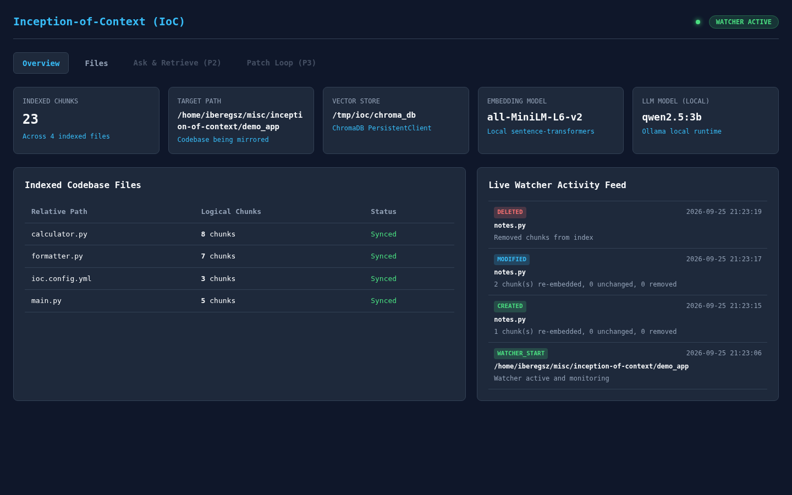
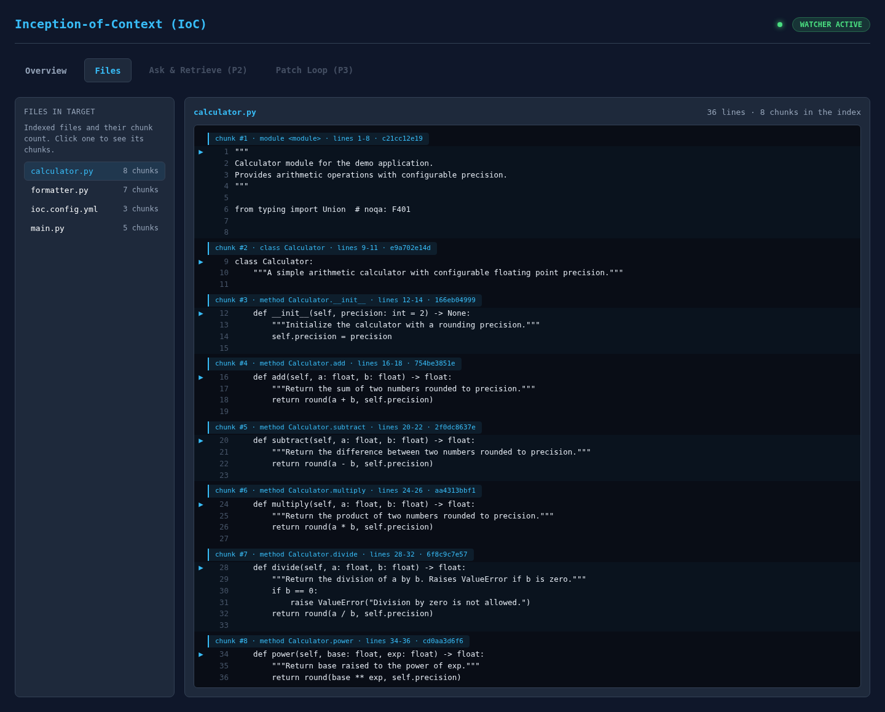
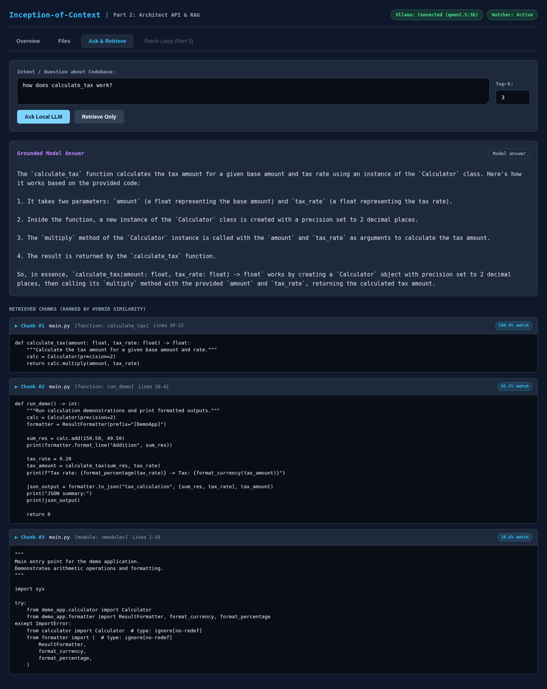
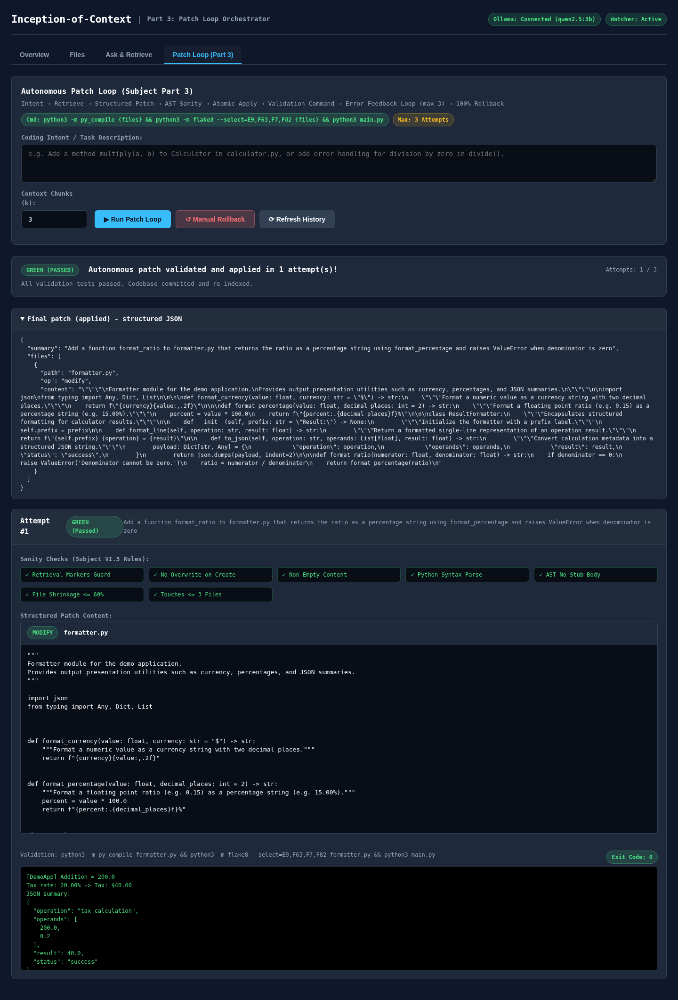
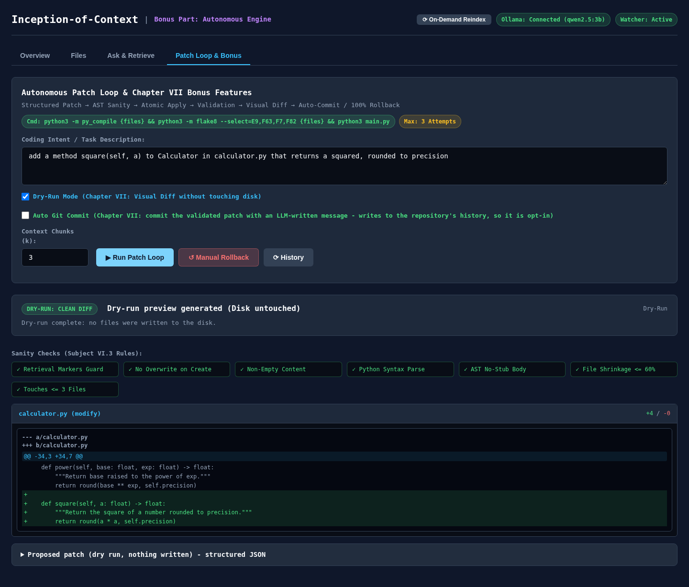
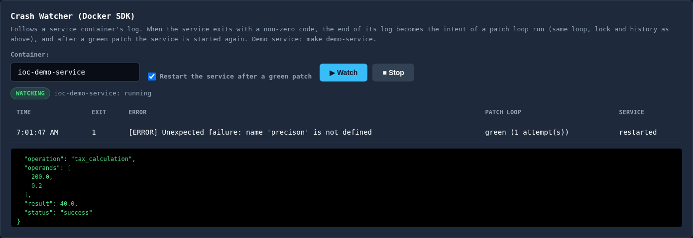
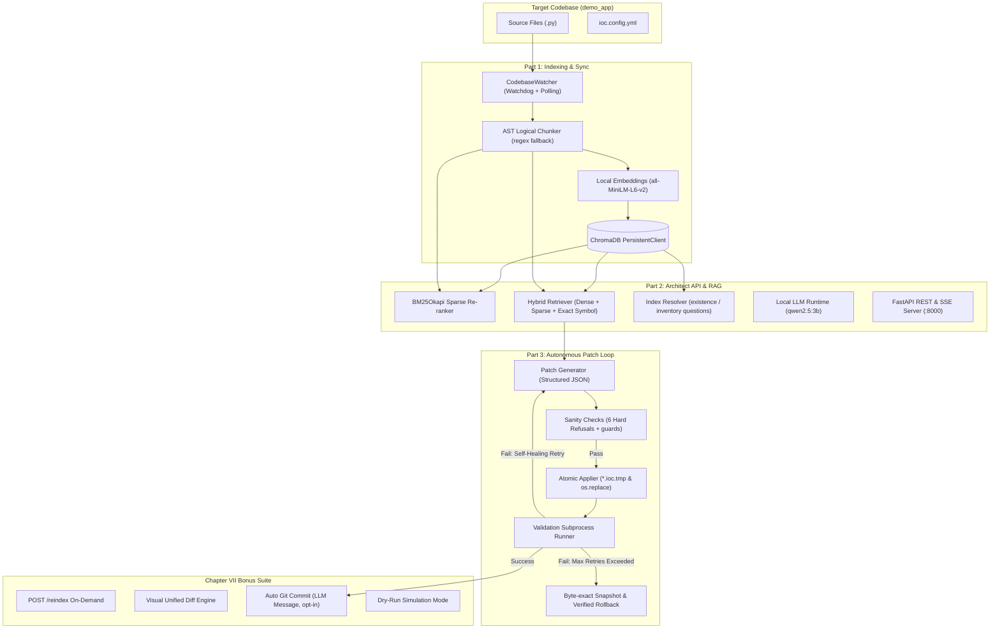

# Inception-of-Context (IoC)

> **AI-Native Autonomous Codebase Engine: Local-First Hybrid RAG, AST-Grounded Context & Self-Healing Patch Loop with Verified Atomic Rollback.**

An offline software engineering agent built for the 42 curriculum. IoC indexes a codebase into logical AST chunks, answers questions about it with a local LLM without inventing symbols, and runs a multi-attempt, self-healing patch loop with hard sanity refusals, a configurable validation command and a rollback that is checked byte-for-byte.

Everything runs on `127.0.0.1`: Ollama (`qwen2.5:3b`) for generation, `all-MiniLM-L6-v2` for embeddings, ChromaDB in `PersistentClient` mode for vectors.

---

## Dashboard Preview

Real captures of the running dashboards (headless Chrome against `make p1`, `make p2`, `make p3` and `make bonus`), not mock-ups.

### 1. Overview (Part 1) - index state and live watcher feed


### 2. Files (Part 1) - every ▶ in the gutter is where an indexed chunk starts


### 3. Ask & Retrieve (Part 2) - grounded answer and the chunks that fed it


### 4. Patch Loop (Part 3) - each attempt recorded (sanity, apply, validation), final patch as JSON


### 5. Bonus - dry run with visual diff, nothing written to disk


### 6. Bonus - crash watcher: a service crashed, the patch loop fixed it, the service runs again


---

## System Architecture


```mermaid
flowchart TD
    subgraph Target["Target Codebase (demo_app)"]
        Src["Source Files (.py)"]
        Config["ioc.config.yml"]
    end

    subgraph P1["Part 1: Indexing & Sync"]
        Watcher["CodebaseWatcher (Watchdog + Polling)"]
        Chunker["AST Logical Chunker (regex fallback)"]
        Embed["Local Embeddings (all-MiniLM-L6-v2)"]
        Chroma[("ChromaDB PersistentClient")]
    end

    subgraph P2["Part 2: Architect API & RAG"]
        BM25["BM25Okapi Sparse Re-ranker"]
        Retriever["Hybrid Retriever (Dense + Sparse + Exact Symbol)"]
        Resolver["Index Resolver (existence / inventory questions)"]
        Ollama["Local LLM Runtime (qwen2.5:3b)"]
        FastAPI["FastAPI REST & SSE Server (:8000)"]
    end

    subgraph P3["Part 3: Autonomous Patch Loop"]
        Generator["Patch Generator (Structured JSON)"]
        Sanity["Sanity Checks (6 Hard Refusals + guards)"]
        Applier["Atomic Applier (*.ioc.tmp & os.replace)"]
        Validator["Validation Subprocess Runner"]
        Rollback["Byte-exact Snapshot & Verified Rollback"]
    end

    subgraph Bonus["Chapter VII Bonus Suite"]
        Reindex["POST /reindex On-Demand"]
        DiffEngine["Visual Unified Diff Engine"]
        GitCommitter["Auto Git Commit (LLM Message, opt-in)"]
        DryRun["Dry-Run Simulation Mode"]
    end

    Src --> Watcher --> Chunker --> Embed --> Chroma
    Chroma & Chunker --> Retriever & BM25
    Chroma --> Resolver
    Retriever --> Generator
    Generator --> Sanity
    Sanity -->|Pass| Applier
    Applier --> Validator
    Validator -->|"Fail: Self-Healing Retry"| Generator
    Validator -->|"Fail: Max Retries Exceeded"| Rollback
    Validator -->|Success| GitCommitter
```

---

## Core Capabilities

### 1. Part 1 - Logical Indexing & Filesystem Synchronization
- **AST code splitting:** one chunk per function, method, class header and module block, decorators included, with exact line ranges and a SHA-256 per chunk. Python that does not parse (a file saved mid-edit) falls back to a regex chunker anchored on `def`/`class` at any indentation; other files are split into blank-line blocks.
- **Chunk-level incremental sync:** editing one method re-embeds that one chunk; unchanged chunks are left alone, vanished ones are deleted, and deleting a file removes all its chunks. Each scan also reconciles against what ChromaDB actually holds, so a deletion the watcher missed is still repaired.
- **Watcher:** watchdog events debounced per file, a 10-second polling fallback for bind mounts where inotify drops events, `CREATED` / `MODIFIED` / `DELETED` in the live feed with chunk counts. One unreadable file is logged as an error; it never stops the watcher.
- **Skips** `node_modules`, `.git`, `dist`, `build`, `venv`, `.venv`, `__pycache__`, hidden paths, binaries (by extension or a NUL byte anywhere) and the vector store itself, by its real location, even when `--db-dir` points inside the target.
- **Offline embeddings:** `all-MiniLM-L6-v2` is downloaded once by `make setup` (or baked into the image) and loaded with `HF_HUB_OFFLINE=1`.

### 2. Part 2 - Architect API & Truthful RAG
- **Hybrid retrieval:** dense cosine similarity blended with BM25Okapi over the Chroma documents, plus an exact-symbol boost. ChromaDB stays the canonical store.
- **The two question shapes the subject grades never reach the model.** *"Is there a function called X?"* (in its natural variants: backticks, `Class.method`, "any … named", "does X exist", "is X defined", "where is X defined", Hungarian) and *"what functions exist in this file / in `main.py` / in class `Calculator`?"* are answered from the index itself: yes/no with file and line range, the full inventory, near-miss names when X does not exist.
- **Everything else** goes to the model with the verified facts first and a complete list of the indexed symbols; the answer is then checked against the index and any name that exists nowhere in the code is flagged. The dashboard badge says which of the two answered.
- **Local LLM:** async Ollama client on `127.0.0.1:11435`, one fixed 8k context for every call.

### 3. Part 3 - Autonomous Patch Loop & Verified Rollback
- **Structured JSON patches:** `{"summary": "...", "files": [{"path": "...", "op": "create|modify|delete", "content": "<complete file>"}]}`. Never a diff. Double quotes and backslashes in the code shown to the model are masked with tokens, because a 3B model under Ollama's grammar-constrained JSON mode cannot be relied on to escape them.
- **Hard refusals before any disk write** (Subject VI.3):
  1. leaked prompt markers (derived from `p1/markers.py`, the single source both prompt builders use),
  2. `create` on an existing file,
  3. a non-empty file replaced by `""`, `"None"` or `"null"`,
  4. a function whose body is only a stub (`pass`, `...`, `return None`, `raise NotImplementedError`) that the patch introduces,
  5. an existing file shrinking by more than 60 %,
  6. more than 3 files at once.

  Plus: invalid Python (the syntax gate), duplicate entries for one file, paths outside the target or into hidden/vendored/binary locations, any edit of `ioc.config.yml` (the patch may not rewrite its own judge), more than one deletion, a patch that changes nothing, a function, class, method or `if __name__ == "__main__":` block removed although the intent does not name it (without its entry point `python3 main.py` runs nothing and passes), and, for a "rename X to Y" intent, `Y` appearing where `X` never was.
- **Prompt scope:** the model sees in full only the files the intent names (for a rename also the files using the name; when it names none, the files retrieval ranks highest); it is told which existing files it may edit, which named files are new, and, for a rename, every line using the old name. An edit of a file it was not shown in full is dropped from the patch and listed as `dropped_unrequested`, never applied silently. For an intent that asks only for a rename, each modified file is kept to the rename: the model decides which uses of the old name it renames, and every other change it made is reverted and listed under `kept_to_rename`.
- **Self-healing loop:** sanity errors or the validation log (tail-capped) go back to the model; up to 3 attempts.
- **Atomic apply:** every file is staged as `*.ioc.tmp`, fsync'ed, then `os.replace`d only when all are ready.
- **Verified rollback:** snapshots are raw bytes plus file mode, keyed by canonical path. After a failed run every touched file is compared byte-for-byte with its snapshot and the result reports `rollback_verified`. A run cancelled mid-flight (Ctrl+C, server shutdown) is rolled back too.
- **Validation isolation:** the command from `ioc.config.yml` is read once per run, runs in its own process group (a hung test is killed as a whole on the 30 s timeout), writes no `__pycache__` into the target, and imports the target's own modules first.

### 4. Chapter VII - Bonus Suite
- **`POST /reindex`:** full re-chunk + re-embed; also purges chunks of files deleted while no watcher was running.
- **Dry-run mode:** generates and sanity-checks the patch and renders its diff without touching the disk.
- **Auto Git commit (opt-in):** after a green run, commits exactly the patch's files (never other staged work) with an LLM-written Conventional Commit message; falls back to a template when Ollama is unavailable.
- **Richer dashboard:** per-chunk relevance scores, a colour-coded visual diff of every attempt, live validation status streamed over SSE.
- **Crash watcher (Docker SDK):** follows a service container's log through the Docker SDK. When the service exits with a non-zero code, the end of its log (the traceback, rewritten to target-relative `file:line`, or the error lines) becomes the intent of a patch loop run - the same loop, lock and history as the Patch Loop tab - and after a green patch the service is started again. A red run leaves the service down for a human; a crash is handled once, and at most 3 crash-triggered runs happen in a row. Dashboard card, `--watch-container`, and `/bonus/crash-watch`.

---

## Getting Started

### Prerequisites
- Linux, Python 3.10+
- Ollama (installed by `make setup` into a private store under `/tmp/ioc`, served on `127.0.0.1:11435`)
- Docker with Compose (optional, for Option A)

---

### Option A: Running with Docker Compose (Recommended for Evaluation)

The image bakes in the `all-MiniLM-L6-v2` embedding weights and flake8 (which
the demo's validation command runs), so the build needs network access once
and the container then runs fully offline. It reaches the host's Ollama on
`127.0.0.1:11435`; `make up` starts that daemon if it is installed but not
running.

```bash
# One-time: create the runtime, start the local Ollama and pull qwen2.5:3b
make setup

# Build and start the containerized system (bonus suite, all tabs)
make up

# Open the dashboard in your browser
http://127.0.0.1:8000

# Rebuild the image after changing code, then recreate the container
make docker-restart

# Stop and tear down containers
make down
```

The container writes into the bind-mounted `demo_app/` and `/tmp/ioc/chroma_db`.
On rootful Docker `make up` runs it as your own uid:gid so those files stay
yours; on rootless Docker it runs as container root, which already maps to you.

---

### Option B: Running Locally

```bash
# 1. Setup local environment (/tmp/ioc venv, dependencies, Ollama model)
make setup

# 2. Run Part 1: Overview + Files dashboard
make p1

# 3. Run Part 2: Architect API & RAG Dashboard
make p2

# 4. Run Part 3: Autonomous Patch Loop Dashboard
make p3

# 5. Run Chapter VII Bonus Suite
make bonus

# 6. Crash watcher: run the target as a service container, then watch it
make demo-service                              # ioc-demo-service runs demo_app/main.py every 5 s
make bonus WATCH_CONTAINER=ioc-demo-service    # or press "Watch" in the Crash Watcher card
# break demo_app so it crashes at run time; the watcher patches it and restarts the service
make demo-service-stop
```

The crash watcher talks to Docker through the SDK (`DOCKER_HOST`, rootless Docker included), so it
runs with `make bonus` on the host; inside the `make up` container there is no Docker socket.

### Cleaning up

```bash
make clean    # stop ollama + IoC container, drop chroma/pip caches
              # keeps the venv AND the embedding weights, so the parts still run
make fclean   # the above + remove the IoC docker image and wipe /tmp/ioc entirely
make re       # fclean + setup
```

---

### Option C: Headless CLI Execution

```bash
# Run headless patch with validation and auto-rollback
python3 p3/index.py demo_app --intent "add a multiply method to Calculator in calculator.py"

# Or using Makefile:
make p3-cli INTENT="add a square method to Calculator in calculator.py"

# Run bonus dry-run simulation (no disk writes)
python3 bonus/index.py demo_app --intent "add divide method" --dry-run
```

---

## Quality Gates

```bash
make lint         # flake8 + mypy over p1 p2 p3 bonus demo_app
make test         # offline regression suite: p1/tests p2/tests p3/tests bonus/tests
make test-p1      # one part only (also test-p2, test-p3, test-bonus)
make gates        # lint + test, fails on the first red gate
```

The suite (stdlib `unittest`, nothing extra to install) needs `make setup`
(it uses the real ChromaDB and embedding model) but not Ollama: every model
call in it is a scripted fake. It runs against a frozen copy of the demo target
(`p1/tests/fixtures/demo_app`), so a live patch-loop session on `demo_app/`
never changes its expectations. `TEST_ARGS="-k rollback"` narrows it.

---

## Validation Configuration (`demo_app/ioc.config.yml`)

| Key | Meaning |
| :--- | :--- |
| `validation_command` | Shell command run from the target root after every applied attempt. `{files}` is replaced by the files the attempt touched. Exit code 0 = green. |
| `validation_file_extensions` | Optional. Only touched files with these suffixes are substituted for `{files}`; when none match (a README-only patch), every `.py` file of the project is validated instead. |

The demo uses three gates: `py_compile` (it parses), `flake8 --select=E9,F63,F7,F82`
(syntax errors and undefined names) and `python3 main.py` (it runs).

---

## REST API Reference

Every endpoint below is served at the documented root path and at an `/api/...`
alias, in all parts. `/status`, `/files` and `/file` work identically under
`make p1`, `make p2`, `make p3` and `make bonus`; the patch and bonus endpoints
appear from Part 3 and the Bonus Suite respectively.

| Method | Endpoint | Description |
| :--- | :--- | :--- |
| `GET` | `/status` | Vector database stats, chunk counts, Ollama connectivity |
| `GET` | `/files` | List of indexed files with chunk counts |
| `GET` | `/file?path=...` | File content plus its indexed chunks (line ranges, hashes) and whether the index is in sync; refuses paths outside the target or excluded from the index |
| `GET` | `/chunks?limit=50&offset=0` | Paginated index chunks, in file/line order |
| `POST`| `/context` | Top-$k$ retrieved chunks with similarity scores |
| `POST`| `/ask` | Grounded Q&A; `answer_source` says whether the index or the model answered |
| `GET` | `/events` | Real-time Server-Sent Events (SSE) stream |
| `POST`| `/patch/run` | Trigger autonomous patch loop (intent, top-k) |
| `GET` | `/patch/status` | Current loop state (idle/running), latest outcome |
| `GET` | `/patch/history` | Audit trail of all patch runs and attempts |
| `POST`| `/patch/rollback` | Revert the last run's files to their pre-run bytes (works after a green run too), with a byte-for-byte check |
| `GET` | `/patch/config` | Active `ioc.config.yml` validation command |
| `POST`| `/reindex` | **[Bonus]** On-demand full index refresh (re-chunks and re-embeds every file; `?full=false` for an incremental sync) |
| `POST`| `/bonus/patch/run` | **[Bonus]** Patch run with `dry_run` and `auto_commit` |
| `POST`| `/bonus/crash-watch` | **[Bonus]** Watch a container (`{"container": ..., "auto_restart": true}`): a crash runs the patch loop |
| `GET` | `/bonus/crash-watch` | **[Bonus]** Watcher state, handled crashes and the service's latest log lines |
| `DELETE`| `/bonus/crash-watch` | **[Bonus]** Stop watching |

---

## Repository Structure

```text
.
├── Dockerfile                  # Container definition (Chapter IV & VIII)
├── .dockerignore               # Keeps caches and tests out of the build context
├── docker-compose.yml          # Container orchestration (make up / make down)
├── Makefile                    # up, down, p1, p2, p3, p3-cli, bonus, lint, test, gates, clean
├── README.md                   # This guide
├── docs/
│   └── images/                 # Dashboard screenshots used above
├── demo_app/                   # Target codebase for testing and defense
│   ├── calculator.py
│   ├── formatter.py
│   ├── main.py
│   └── ioc.config.yml          # Validation command configuration
├── p1/                         # Part 1: Indexing and Synchronization
│   ├── requirements.txt
│   ├── markers.py              # Prompt section markers shared by P2, P3 & sanity
│   ├── chunker.py              # AST chunker, regex fallback, SHA-256 per chunk
│   ├── db.py                   # ChromaDB PersistentClient wrapper
│   ├── indexer.py              # Chunk-level incremental sync & ignore rules
│   ├── watcher.py              # Filesystem event watcher (watchdog + polling)
│   ├── dashboard.py            # Overview + Files UI & SSE feed
│   ├── dashboard_files.py      # Files tab (gutter view) + GET /file, shared by all parts
│   ├── dashboard_modal.py      # Themed dialogs shared by all parts
│   ├── index.py                # Part 1 CLI entry point
│   └── tests/                  # Part 1 tests + shared fixtures (frozen demo_app copy)
├── p2/                         # Part 2: Architect API and RAG
│   ├── requirements.txt
│   ├── retriever.py            # Hybrid dense/BM25 retriever & index resolver
│   ├── llm.py                  # Local Ollama client, grounded prompt, answer policy
│   ├── api.py                  # FastAPI REST endpoints & SSE
│   ├── dashboard.py            # Overview, Files, Ask & Retrieve
│   ├── index.py                # Part 2 CLI entry point
│   └── tests/
├── p3/                         # Part 3: Patch Loop, Sanity & Rollback
│   ├── requirements.txt
│   ├── sanity.py               # Hard refusal rules
│   ├── applier.py              # Atomic staging (*.ioc.tmp) & verified rollback
│   ├── generator.py            # Structured JSON patch generation (masked prompt)
│   ├── loop.py                 # 3-attempt self-healing retry engine
│   ├── api.py                  # Patch Loop REST API & concurrency lock
│   ├── dashboard.py            # 4-tab UI including Patch Loop
│   ├── index.py                # Part 3 CLI entry point
│   └── tests/
└── bonus/                      # Chapter VII: Bonus Suite
    ├── requirements.txt        # docker (SDK) for the crash watcher
    ├── diff_engine.py          # Unified & visual diff generator
    ├── git_committer.py        # Automatic Git commit with LLM message
    ├── crash_watcher.py        # Docker SDK: follow a service's log, patch on crash
    ├── api.py                  # POST /reindex & dry-run API
    ├── dashboard.py            # Enhanced UI with diffs & toggles
    ├── index.py                # Bonus CLI entry point
    └── tests/
```
